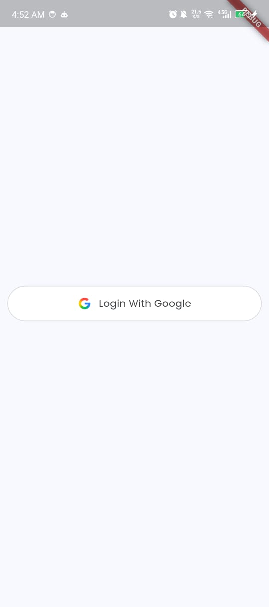
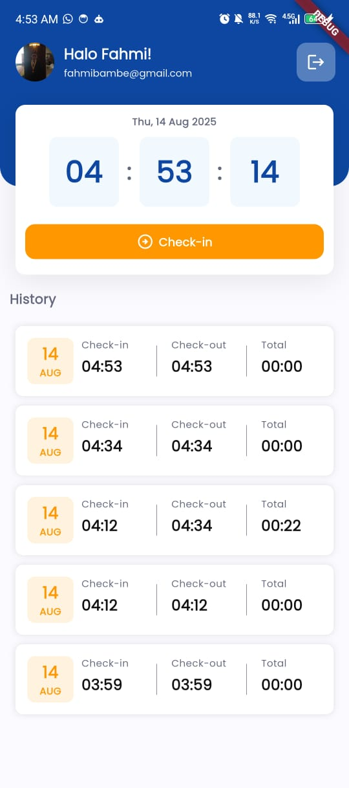
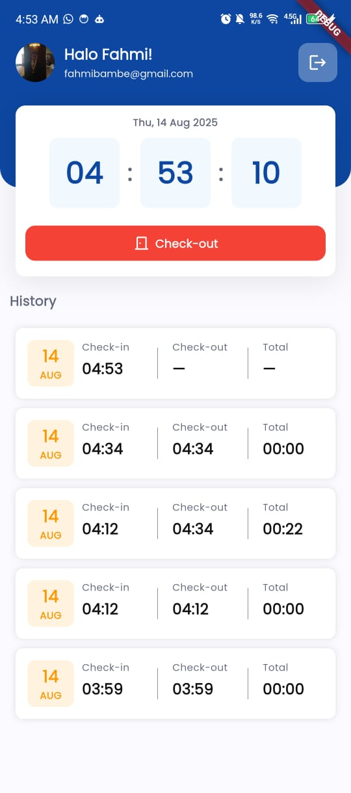
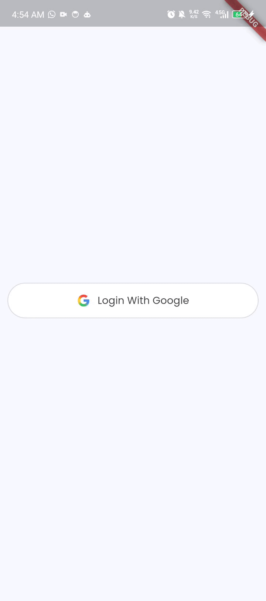

# ATTENDANCE FLUTTER

> **Flutter**: 3.29.3  
> **State management**: Provider  
> **Backend**: Firebase Auth (Google), Cloud Firestore

Aplikasi latihan sederhana untuk **check-in / check-out** yang fokus pada **kode simpel** dan **UX mulus**:

- 🔐 Login Google
- ⏰ Live clock (WIB)
- 🟢 Check-in / 🔴 Check-out
- 📝 Riwayat real-time

---

## ✨ Fitur

- Login dengan **Google Sign-In**
- Live clock **WIB** (update tiap detik)
- **Check-in** membuat dokumen baru
- **Check-out** menutup check aktif (dok terbaru tanpa `checkOutAt`)
- Riwayat dalam **satu daftar** (terbaru di atas)

---

## 📱 Screenshot

| Layar             | Gambar                                   |
| ----------------- | ---------------------------------------- |
| Sign In           |  |
| Home (Live Clock) |       |
|                   |     |

---

## 📦 Unduh APK

- **APK (Release)**: [Download](docs/apk/app-release.apk)

---

## 🎬 Demo Video

- **Tonton demo**:
  

---

## 🧰 Tech Stack

- Flutter **3.29.3**
- Firebase: **Authentication (Google)**, **Cloud Firestore**
- **provider** (state management)
- **intl** (format tanggal/waktu)

---
